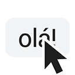

<p align="center">
  
  <h1 align="center">
    Quick Reply Meet
  </h1>

  <p align="center">
    An extension to send messages in Google Meet chat without typing.
    <br />
    <a href="https://chromewebstore.google.com/detail/quick-reply-meet/dodpcgfhomjldnenagdibjcoofheocfc"><strong>Add to Chrome »</strong></a>
    <br />
    <a href="https://addons.mozilla.org/firefox/addon/quick-reply-meet/">Add to Firefox</a> • <a href="https://microsoftedge.microsoft.com/addons/detail/quick-reply-meet/lonfbmmkmojfammfcljbnelobfnhpigk">Add to Edge</a> • <a href="https://quickreplymeet.enzon19.com">Website</a>
  </p>

</p>

## Screenshots

Click an image to view full size.

<div align="center">
  
</div>

## About

The Quick Reply Meet extension allows you to send pre-made messages in Google Meet™ chat with just one click, keyboard shortcuts or automatic responses, saving time during meetings and online classes.

You can create messages that appear as buttons in the chat interface, assign keyboard shortcuts for quick sending, or set up automatic triggers using REGEX to respond to specific messages.

Quick Reply Meet also offers full customization: manage your messages through a modern popup, choose how and where buttons appear, and import/export your settings. Everything is stored locally in your browser.

## Development

To reproduce the project locally for development or contribution:

1. **Clone the repository**

   ```bash
   git clone https://github.com/enzon19/quick-reply-meet.git
   cd quick-reply-meet
   ```

2. **Install dependencies and run in development mode**

   ```bash
   bun install
   bun run dev
   ```
    Use `bun run dev:firefox` if you are targeting Firefox.

3. **Load the extension in your browser**
   - **Chrome**:
     - Go to `chrome://extensions/`
     - Enable _Developer mode_
     - Click _Load unpacked_ and select the `.output/chrome-mv3` folder

   - **Firefox**:
     - Go to `about:debugging#/runtime/this-firefox`
     - Click _Load Temporary Add-on_ and select the `manifest.json` file in the `.output/firefox-mv2` folder

## Website

The website source code is available in the `website` branch.
